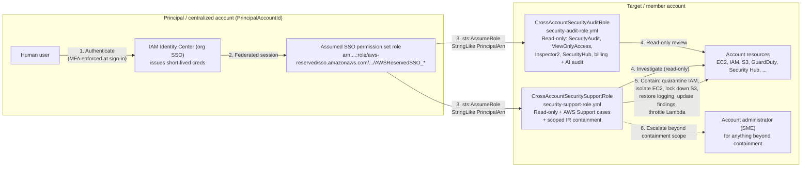

# Cloudformation Templates for security and audit functions in an AWS Account

## Role assumption flow

Both roles below are deployed into a target/member account and assumed cross-account by a human who has already authenticated through the organization's IAM Identity Center (SSO) in a centralized principal account. The trust policy on each role restricts who can assume it (a specific SSO permission set/role ARN pattern, plus an optional MFA condition that must stay off for IAM Identity Center users) rather than trusting the whole principal account.



## security-audit-role.yml

This role incorporates the following AWS Managed permissions to allow access to review service configurations in support of a security reviewer or audit function. This stack is intended to be deployed to support role assumption from a trusted or a centralized IAM account.

- `arn:aws:iam::aws:policy/AmazonInspector2ReadOnlyAccess`
- `arn:aws:iam::aws:policy/AWSSecurityHubReadOnlyAccess`
- `arn:aws:iam::aws:policy/SecurityAudit`
- `arn:aws:iam::aws:policy/job-function/ViewOnlyAccess`

It also grants a supplemental inline read-only policy (`SupplementalReadOnlyAccess`) covering services not fully captured by the managed policies above: notifications, IAM Access Analyzer, Service Discovery, GuardDuty/Macie/Shield/WAFv2/ECR describe-level access, CloudTrail, `sts:GetCallerIdentity`, AWS Organizations/root-access context, CodeStar-family services, account/billing/cost visibility, and AI service usage auditing (Bedrock, Bedrock AgentCore, Q Business, Q Developer/CodeWhisperer).

`sts:GetCallerIdentity` was added (`STSCallerIdentity` Sid, template version 3.1) to support the [`skill/`](../skill/SKILL.md) audit skill, whose collector script calls it first to verify the assumed role and resolve the account ID before collecting anything else — neither `SecurityAudit` nor `job-function/ViewOnlyAccess` covers this action.

`organizations:DescribeOrganization`, `iam:ListOrganizationsFeatures`, and `iam:ListEntitiesForPolicy` were added (`OrganizationsRootAccessContext` Sid, template version 3.2) to support the same audit skill's handling of false positives on root-account and full-admin-policy findings:

- `organizations:DescribeOrganization` works from any member account and tells the collector whether the account belongs to an organization at all (org ID, management account ID, feature set) — context the report can show even when the next permission can't be exercised.
- `iam:ListOrganizationsFeatures` only succeeds when called from the Organizations **management account** or an account delegated as IAM's trusted administrator; from a plain member account it fails with `AccountNotManagementOrDelegatedAdministrator`, which the collector treats as expected rather than an error. When it does succeed, it tells the skill whether root credentials are centrally managed via AWS Organizations, so a root user with its credentials deliberately removed org-wide isn't flagged as if it were simply unsecured.
- `iam:ListEntitiesForPolicy` lets the collector record which specific roles/users/groups hold each admin-wildcard (`Action:*`, `Resource:*`) policy, so the skill can flag the actual principal by name instead of just the policy, and a named break-glass/admin role can be excepted without hiding every other attachment.

None of these three grant write access or let the role query any other account's data. See [`skill/references/exceptions-and-exclusions.md`](../skill/references/exceptions-and-exclusions.md) for how the skill uses this.

### Trust policy (security-audit-role)

The trust policy allows `sts:AssumeRole` from principals in the account identified by the `PrincipalAccountId` parameter (via the `aws:PrincipalAccount` condition, since AWS IAM Identity Center permission set role ARNs contain a generated path segment that can't be referenced directly as an IAM `Principal`). Two additional parameters narrow this further:

- **`TrustedPrincipalArnPattern`** (required) — an `aws:PrincipalArn` `StringLike` pattern that restricts assumption to a specific SSO permission set or role, e.g. `arn:aws:iam::<PrincipalAccountId>:role/aws-reserved/sso.amazonaws.com/*AWSReservedSSO_YourPermissionSetName_*`. The leading `*` matches with or without the region path segment Identity Center adds when its home region isn't `us-east-1`. Pass `"*"` only if you intentionally want to trust every IAM principal in the account.
- **`RequireMFA`** (default `"false"`) — adds an `aws:MultiFactorAuthPresent` condition. Must be `"false"` if your workforce users access AWS through IAM Identity Center: Identity Center sessions never carry `aws:MultiFactorAuthPresent`, so `"true"` locks every SSO user out of the role. Enforce MFA at Identity Center sign-in instead. Only set it to `"true"` for IAM users or federated principals whose sessions are issued with MFA context.

**`MaxSessionDurationSeconds`** (default `7200`, 3600–43200) sets the role's `MaxSessionDuration`.

### Testing this role in the same account before wiring up cross-account SSO

You don't need a separate centralized account to validate that this role and the audit skill actually work together. Deploy it with **`PrincipalAccountId` set to the same account you're deploying into**, and `TrustedPrincipalArnPattern` matching whatever identity you'll actually be using — the trust policy's conditions don't care whether the assuming principal is in a different account or the same one.

Important detail if you're testing from **CloudShell**: CloudShell itself needs permissions beyond anything this role grants (it's deliberately read-only), so you open CloudShell under your normal console identity first — not as the audit role — and assume the role from inside that CloudShell session to get a scoped, temporary credential set for the actual collection step. Concretely, in the account you're testing against:

1. Sign in to that account's AWS Console and open **CloudShell** there (CloudShell always runs under whatever identity is currently signed in — it can't itself assume a role as a precondition to opening).
2. `aws sts get-caller-identity` to see the exact ARN of that session — use it (or a pattern covering it) as `TrustedPrincipalArnPattern` when you deploy this template.
3. Assume the role, short-lived, for just this test:
   ```bash
   export AUDIT_ROLE_ARN="arn:aws:iam::<account-id>:role/<org_prefix>-CrossAccountSecurityAuditRole"
   eval $(aws sts assume-role --role-arn $AUDIT_ROLE_ARN \
     --role-session-name audit-test-session --duration-seconds 900 \
     | jq -r '.Credentials | "export AWS_ACCESS_KEY_ID=\(.AccessKeyId)\nexport AWS_SECRET_ACCESS_KEY=\(.SecretAccessKey)\nexport AWS_SESSION_TOKEN=\(.SessionToken)\n"')
   aws sts get-caller-identity   # confirm the Arn now shows assumed-role/<org_prefix>-CrossAccountSecurityAuditRole/audit-test-session
   ```
4. Continue with `../skill/SKILL.md` Step 2.3 onward (install boto3, run the collector) using these temporary, scoped credentials rather than your original CloudShell identity — that's what actually exercises the role, not just your own admin access.

Once this works end to end, redeploy (or add a second stack) with `PrincipalAccountId`/`TrustedPrincipalArnPattern` pointed at your real centralized/SSO account for production use.

### Notes (security-audit-role)

- Audit Manager access was removed (the service is being discontinued); the supplemental policy was renamed from `AuditManagerReadOnlyAccess` accordingly, since it's now read-only end to end.
- The legacy `aws-portal:View*` billing action was replaced with the current fine-grained `account`/`billing`/`ce`/`consolidatedbilling`/`cur`/`freetier`/`invoicing`/`payments`/`tax` service actions.
- The stack output is `SecurityAuditRoleArn` (previously the misleadingly named `RootAdminRoleArn`).

## security-support-role.yml

This role is for incident investigation and handling: broad read access, AWS Support case management, and a curated set of containment actions to stop active damage. It assumes an account administrator is available as a subject-matter expert for anything beyond first-response containment - it is deliberately not AdministratorAccess. This stack is intended to be deployed to support role assumption from a trusted or a centralized IAM account.

- `arn:aws:iam::aws:policy/AmazonInspector2ReadOnlyAccess`
- `arn:aws:iam::aws:policy/AWSSecurityHubReadOnlyAccess`
- `arn:aws:iam::aws:policy/AWSSupportAccess`
- `arn:aws:iam::aws:policy/ReadOnlyAccess`
- `arn:aws:iam::aws:policy/SecurityAudit`

### Trust policy (security-support-role)

Same hardening as `security-audit-role.yml`: `TrustedPrincipalArnPattern` (required) scopes assumption to a specific SSO permission set/role, `RequireMFA` (default `"false"`) adds an MFA condition, and `MaxSessionDurationSeconds` (default `3600`) sets the role's `MaxSessionDuration`. See that section above for details.

### Containment permissions (security-support-role, `IncidentResponseContainment` inline policy)

Beyond read access and Support cases, the role can take these first-response containment actions:

- **`IAMCredentialContainment`** — deactivate a compromised IAM user's access keys (`iam:UpdateAccessKey`) and console password (`iam:DeleteLoginProfile`), and tag the identity for tracking.
- **`IAMQuarantineAttach`** — attach a quarantine policy to a compromised user or role. The `iam:PolicyARN` condition locks this to exactly one policy ARN (`IamQuarantinePolicyArn`, default the AWS-maintained `AWSCompromisedKeyQuarantineV3`) so the permission can't be used to attach `AdministratorAccess` or anything else — this is what stops the grant from being a privilege-escalation hole. `AWSCompromisedKeyQuarantineV3` denies privilege-escalation and abuse-enabling actions (attaching/creating policies, creating access keys, `PassRole`, `RunInstances`, `CreateBucket`, etc.); it doesn't revoke all access, since its purpose is containment for forensic review, not full lockout.
- **`Ec2NetworkIsolation`** — swap a compromised instance's security groups, revoke SG rules, and take forensic snapshots/AMIs. Intentionally excludes `Authorize*SecurityGroup*` (would let the role open access, not just close it) and `StartInstances`/`StopInstances`/`TerminateInstances`/`RunInstances`.
- **`S3ExposureLockdown`** — turn on Block Public Access and set a bucket ACL to private. Intentionally excludes `s3:PutBucketPolicy`, since bucket-policy writes can grant access just as easily as they can restrict it.
- **`LoggingControlRestoration`** — restart CloudTrail logging/event selectors, a stopped Config recorder, or a disabled GuardDuty detector if an attacker turned off logging.
- **`FindingWorkflowUpdates`** — update Security Hub/GuardDuty finding status, notes, and archival state for triage tracking.
- **`LambdaSecretsContainment`** — throttle a suspicious Lambda function to zero concurrency, disable an event source mapping, and trigger Secrets Manager rotation for a compromised secret (does not reveal secret values).

Deliberately **not** included, left to the account administrator: network-path blocking (VPC NACLs, WAFv2 web ACLs) and SSM Run Command/Session Manager access to instances — both are more powerful and higher-blast-radius than a first-responder role needs when an admin SME is available.

## create_account_access_analyzer.yml

Creates an IAM Access Analyzer (`Type: ORGANIZATION`) that reports resources shared outside the organization, and optionally an unused access analyzer.

Prerequisites: trusted access for IAM Access Analyzer must be enabled in AWS Organizations, and the stack must be deployed in the organization's management account or the Access Analyzer delegated administrator account.

Access Analyzer is regional. Deploy the stack in every region you use (for example with a StackSet) to get full external access coverage.

### Unused access analyzer (paid, off by default)

Set **`EnableUnusedAccessAnalyzer`** to `"true"` to also create an `ORGANIZATION_UNUSED_ACCESS` analyzer, which reports unused IAM roles, unused IAM user access keys and passwords, and unused permissions across every account in the organization. **`UnusedAccessAgeDays`** (default `90`, 1–365) sets how long something must go unused before it is reported.

> [!WARNING]
> The unused access analyzer is a paid feature, billed monthly per IAM role and IAM user analyzed across all member accounts, for each unused access analyzer you create. Estimate the cost with the [IAM Access Analyzer pricing page](https://aws.amazon.com/iam/access-analyzer/pricing/) before enabling it. IAM is global, so enable it in only one region: turning it on in every region where you deploy this stack multiplies the charge without adding findings.

## Using this role with the audit skill

The [`skill/`](../skill/SKILL.md) directory at the repo root is a Claude skill that runs an AWS account security audit (against CIS, Well-Architected, SOC 2, or ISO/IEC 27001) using the role deployed by this template as its live-data access path. See `skill/SKILL.md` Step 2 for the full assume-role-and-collect workflow.

## Other templates

- **`assume-role.yml`** — creates an IAM group whose members can `sts:AssumeRole` into the role ARNs passed in `TargetAccountRoleARNs`. The default (`arn:aws:iam::123456789012:role/ROLE_NAME`) is a placeholder; override it with your real role ARNs.
- **`EnableAWSConfig.yml`** — enables AWS Config with an encrypted S3 delivery bucket. The bucket is retained if the stack is deleted or the bucket is replaced, so recorded configuration history isn't lost.

## Validating templates

```bash
cfn-lint cloudformation/*.yml
```
