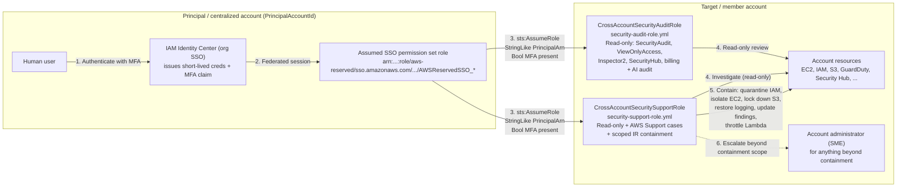

# Cloudformation Templates for security and audit functions in an AWS Account

## Role assumption flow

Both roles below are deployed into a target/member account and assumed cross-account by a human who has already authenticated through the organization's IAM Identity Center (SSO) in a centralized principal account. The trust policy on each role restricts who can assume it (a specific SSO permission set/role ARN pattern, plus optionally a live MFA claim) rather than trusting the whole principal account.

## security-audit-role.yml

This role incorporates the following AWS Managed permissions to allow access to review service configurations in support of a security reviewer or audit function. This stack is intended to be deployed to support role assumption from a trusted or a centralized IAM account.

- `arn:aws:iam::aws:policy/AmazonInspector2ReadOnlyAccess`
- `arn:aws:iam::aws:policy/AWSSecurityHubReadOnlyAccess`
- `arn:aws:iam::aws:policy/SecurityAudit`
- `arn:aws:iam::aws:policy/job-function/ViewOnlyAccess`

It also grants a supplemental inline read-only policy (`SupplementalReadOnlyAccess`) covering services not fully captured by the managed policies above: notifications, IAM Access Analyzer, Service Discovery, GuardDuty/Macie/Shield/WAFv2/ECR describe-level access, CloudTrail, CodeStar-family services, account/billing/cost visibility, and AI service usage auditing (Bedrock, Bedrock AgentCore, Q Business, Q Developer/CodeWhisperer).

### Trust policy (security-audit-role)

The trust policy allows `sts:AssumeRole` from principals in the account identified by the `PrincipalAccountId` parameter (via the `aws:PrincipalAccount` condition, since AWS IAM Identity Center permission set role ARNs contain a generated path segment that can't be referenced directly as an IAM `Principal`). Two additional parameters narrow this further:

- **`TrustedPrincipalArnPattern`** (required) — an `aws:PrincipalArn` `StringLike` pattern that restricts assumption to a specific SSO permission set or role, e.g. `arn:aws:iam::<PrincipalAccountId>:role/aws-reserved/sso.amazonaws.com/*/AWSReservedSSO_YourPermissionSetName_*`. Pass `"*"` only if you intentionally want to trust every IAM principal in the account.
- **`RequireMFA`** (default `"true"`) — adds an `aws:MultiFactorAuthPresent` condition. Only leave this as `"true"` if your identity provider/IAM Identity Center actually propagates MFA status on the sessions it issues; otherwise set it to `"false"` to avoid locking yourself out.

**`MaxSessionDurationSeconds`** (default `3600`, 3600–43200) sets the role's `MaxSessionDuration`.

### Notes (security-audit-role)

- Audit Manager access was removed (the service is being discontinued); the supplemental policy was renamed from `AuditManagerReadOnlyAccess` accordingly, since it's now read-only end to end.
- The legacy `aws-portal:View*` billing action was replaced with the current fine-grained `account`/`billing`/`ce`/`consolidatedbilling`/`cur`/`freetier`/`invoicing`/`payments`/`tax` service actions.
- The stack output is `SecurityAuditRoleArn` (previously the misleadingly named `RootAdminRoleArn`).

## security-support-role.yml

This role is for incident investigation and handling: broad read access, AWS Support case management, and a curated set of containment actions to stop active damage. It assumes an account administrator is available as a subject-matter expert for anything beyond first-response containment - it is deliberately not AdministratorAccess. This stack is intended to be deployed to support role assumption from a trusted or a centralized IAM account.

- `arn:aws:iam::aws:policy/AmazonInspector2ReadOnlyAccess`
- `arn:aws:iam::aws:policy/AWSSecurityHubReadOnlyAccess`
- `arn:aws:iam::aws:policy/AWSSupportAccess`
- `arn:aws:iam::aws:policy/ReadOnlyAccess`
- `arn:aws:iam::aws:policy/SecurityAudit`

### Trust policy (security-support-role)

Same hardening as `security-audit-role.yml`: `TrustedPrincipalArnPattern` (required) scopes assumption to a specific SSO permission set/role, `RequireMFA` (default `"true"`) adds an MFA condition, and `MaxSessionDurationSeconds` (default `3600`) sets the role's `MaxSessionDuration`. See that section above for details.

### Containment permissions (security-support-role, `IncidentResponseContainment` inline policy)

Beyond read access and Support cases, the role can take these first-response containment actions:

- **`IAMCredentialContainment`** — deactivate a compromised IAM user's access keys (`iam:UpdateAccessKey`) and console password (`iam:DeleteLoginProfile`), and tag the identity for tracking.
- **`IAMQuarantineAttach`** — attach a quarantine policy to a compromised user or role. The `iam:PolicyARN` condition locks this to exactly one policy ARN (`IamQuarantinePolicyArn`, default the AWS-maintained `AWSCompromisedKeyQuarantineV3`) so the permission can't be used to attach `AdministratorAccess` or anything else — this is what stops the grant from being a privilege-escalation hole. `AWSCompromisedKeyQuarantineV3` denies privilege-escalation and abuse-enabling actions (attaching/creating policies, creating access keys, `PassRole`, `RunInstances`, `CreateBucket`, etc.); it doesn't revoke all access, since its purpose is containment for forensic review, not full lockout.
- **`Ec2NetworkIsolation`** — swap a compromised instance's security groups, revoke SG rules, and take forensic snapshots/AMIs. Intentionally excludes `Authorize*SecurityGroup*` (would let the role open access, not just close it) and `StartInstances`/`StopInstances`/`TerminateInstances`/`RunInstances`.
- **`S3ExposureLockdown`** — turn on Block Public Access and set a bucket ACL to private. Intentionally excludes `s3:PutBucketPolicy`, since bucket-policy writes can grant access just as easily as they can restrict it.
- **`LoggingControlRestoration`** — restart CloudTrail logging/event selectors, a stopped Config recorder, or a disabled GuardDuty detector if an attacker turned off logging.
- **`FindingWorkflowUpdates`** — update Security Hub/GuardDuty finding status, notes, and archival state for triage tracking.
- **`LambdaSecretsContainment`** — throttle a suspicious Lambda function to zero concurrency, disable an event source mapping, and trigger Secrets Manager rotation for a compromised secret (does not reveal secret values).

Deliberately **not** included, left to the account administrator: network-path blocking (VPC NACLs, WAFv2 web ACLs) and SSM Run Command/Session Manager access to instances — both are more powerful and higher-blast-radius than a first-responder role needs when an admin SME is available.
